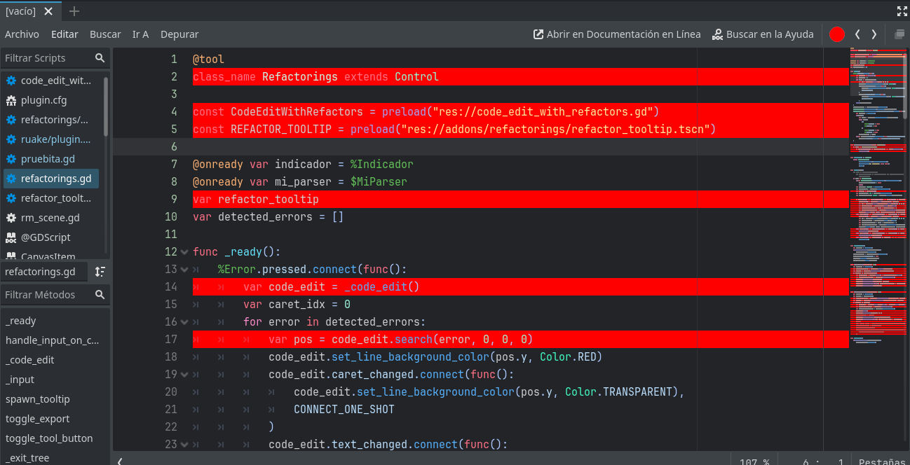

# Refactorings

⚠️ **Experimental** ⚠️
Esto está _usable_ (ponele) pero super incompleto aún.

Este proyecto es un addon para agregar refactors automáticos para el editor de código de Godot.

Tiene refactors que llegan hasta Godot 4.4.

# Requerimientos para desarrollar en este repo

### Godot

https://godot-rust.github.io/book/intro/setup.html#godot-engine

### Rust

https://godot-rust.github.io/book/intro/setup.html#rust

# Como llevar cambios del proyecto en rust al proyecto de Godot

Dentro de la carpeta `rust`, correr `cargo build`. Esto debería generar archivos dentro de `godot/addons/refactorings/bin`.

# Algunos refactorings en progreso

- Extraer variable
  
  

- Inlinear variable
  
  

- Alternar anotación `@export`
  
  

- Activar/Desactivar la exposición de una función con la anotación `@export_tool_button` y una variable
  
  

# ¿Qué falta?

Una buena forma de encontrar que cosas todavía no están implementadas, es ir a algún script valido de godot, y si la pelotita que indica si el archivo pudo ser parseado es roja, clickearla y ver todas las lineas que aparecen en rojo. Esas lineas tienen cosas que nuestro parser AUN no soporta, ¡podes implementarlo y mandar un PR!

https://github.com/JuanFdS/godot-refactors/issues
